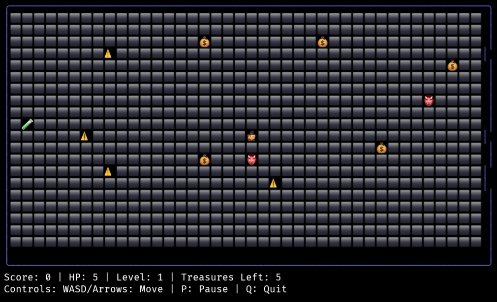

# Dungeon Dash  

A terminal-based dungeon crawler game built with Go and Bubble Tea. Navigate through levels, collect treasures, avoid traps and enemies, and survive as long as possible!  

<p align="center">
  
</p>

## Features  

- **Responsive Terminal UI**: Automatically adapts to your terminal size
- **Progressive Difficulty**: Each level gets harder with more enemies and faster movement
- **Smart Enemy AI**: Enemies track and chase the player in real-time
- **Balanced Health System**: HP cap prevents exploitation, rare healing potions
- **Smooth Controls**: Responsive movement with optimized timing
- **Beautiful Countdown**: ASCII art countdown dialogs between levels
- **Score Tracking**: Collect treasures to increase your score
- **Unicode Graphics**: Beautiful emoji-based game elements  

## Installation  

### Prerequisites  

- Go 1.25.0 or higher  

### Build from Source  

```bash  
git clone https://github.com/Cod-e-Codes/dungeon-dash.git  
cd dungeon-dash  
go mod download  
go build -o dungeon-dash
```

### Run directly with Go

```bash
go run main.go
```

## How to Play

### Objective

Collect all treasures on each level while avoiding traps and enemies. Each level increases in difficulty with more enemies and faster movement.

### Controls

- **Movement**: WASD or Arrow keys
- **Pause**: P
- **Quit**: Q or Ctrl+C
- **Restart**: R (when game over)

### Game Elements

- **🧙 Player**: Wizard character you control
- **💰 Treasures**: Collect all to advance to next level
- **⚠️ Traps**: Damage player on contact, respawn after being triggered
- **👹 Enemies**: Move toward player, damage player on contact
- **🧪 Potions**: Restore health when collected (rare spawns)

### Mechanics

- Player starts with 5 HP (maximum 10 HP)
- Taking damage from traps or enemies reduces HP by 1
- Game over when HP reaches 0
- Potions increase HP by 1 (only spawn every 3rd level)
- HP persists between levels (no more grinding early levels!)
- Enemy movement speed increases with each level
- More enemies and traps spawn as levels progress
- Responsive countdown dialogs before each level starts

## Technical Details

### Dependencies

- [Bubble Tea](https://github.com/charmbracelet/bubbletea) v1.3.9 - Terminal UI framework
- [Lipgloss](https://github.com/charmbracelet/lipgloss) v1.1.0 - Style and layout library

### Game Configuration

- **Board size**: Responsive to terminal size (minimum 20x10)
- **Move delay**: 100ms (optimized for responsive controls)
- **Enemy delay**: 500ms (decreases with level)
- **Starting HP**: 5 (maximum 10)
- **Treasures per level**: 5 + (level-1) * 2
- **Traps per level**: 3 + level
- **Enemies per level**: 2 + level/2
- **Potions**: 1 every 3rd level (levels 3, 6, 9, etc.)

### Recent Improvements

- ✅ **Responsive Terminal UI**: Game adapts to any terminal size
- ✅ **Balanced Health System**: HP cap and rare potions prevent exploitation
- ✅ **Improved Controls**: More responsive movement with better timing
- ✅ **Beautiful Countdown**: ASCII art dialogs with proper overlay
- ✅ **HP Persistence**: Keep HP upgrades between levels
- ✅ **Fixed Bugs**: No more instant death from enemies, no layout shifts

## License

This project is licensed under the MIT License.

## Contributing

Contributions are welcome. Please submit issues and pull requests through GitHub.
